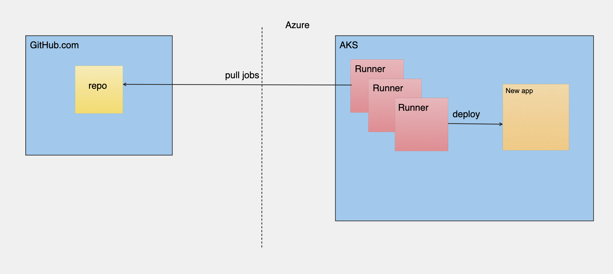

# Self-Hosted GitHub Actions Runner On AKS (Azure Kubernetes Service) with auto-scale option
[](https://github.com/yaronpri/GithubRunnerOnAKS/actions/workflows/deployIaC.yaml)
[](https://github.com/yaronpri/GithubRunnerOnAKS/actions/workflows/deployApp.yaml)
[](https://github.com/yaronpri/GithubRunnerOnAKS/actions/workflows/buildImage.yaml)

This repo will demo shortly the following:
- Bicep deployment, which responsible to following tasks:
  - AKS deployment
  - Install [GitHub Actions Runner Controller (ARC)](https://github.com/actions-runner-controller/actions-runner-controller/blob/master/docs/detailed-docs.md) on AKS with auto-scale configuration
- Deploying sample app using the installed self-hosted runner to AKS cluster without keeping Azure password in Github account

## Simple Diagram of End State
After deploy the below instuctions, the outcome will be:


## Prerequisites
- Fork this repo to your github account
- In the forked repo [Configure OpenID Connect in Azure](https://learn.microsoft.com/en-us/azure/developer/github/connect-from-azure?tabs=azure-portal%2Clinux)
- Create additional GitHub Secrets in the repo: 
  - name: SSH_PUBLIC_KEY, value: [public key of ssh key which will be used during AKS creation]
  - name: RUNNER_TOKEN, value: Log-in to a GitHub account that has admin privileges for the repository, and [create a personal access token](https://github.com/settings/tokens/new) with the appropriate scopes - for this demo:
  -  repo (Full Control)
  -  write:packages


## Important Tweak 
In order to have the runner with AZ CLI and kubectl utilities already installed - I compiled a new image [ghcr.io/yaronpri/githubrunneronaks:main] and update the [actions-runner-controller](runner/actions-runner-controller.yaml) in order to use it as one of the args for controller-manager 
<br>You have in the repo the [Dockerfile](Dockerfile) and the kubectl utility (v.1.25.4)

##### You can read more about it in [this](https://freshbrewed.science/2021/12/01/gh-actions.html) great blog post

## Deployment
### 1st Step - Use Bicep to deploy AKS and self-hosted Github Runners 
Deploy an AKS cluster and install Github Action Runners by triggering manually the GitHub action - DeployRunnerAKS 
- Change the resource group, region, cluster name and admin user name by modifiying [the action file](.github/workflows/deployIaC.yaml)
- Update the repo name in [runnerdeployment.yaml](runner/runnerdeployment.yaml) to yours or change it to work at organization level

### 2nd step - Deploy sample app using self-hosted runner 
The second step is to deploy the sample app by trigerring manually the Github action - DeploySampleApp.
You will notice that the deployment of the app done by the self-hosted GitHub runners.
In order to check the auto-scale - just trigger the 'DeploySampleApp' several times and you will notice that additional runners being added.

## How to connect the runner to GitHub Server Enterprise (GHES)
In order to connect to GHES, a few changes need to be implemented in [actions-runner-controller.yaml](runner-on-ghes/actions-runner-controller.yaml):

Also,
As probably the GHES is installed with certificate you should get the root/intermediate CA and create tls secret in the actions-runner-system and default (where the runner is deployed) namespace

e.g. 
```
kubectl create secret generic ghecert -n actions-runner-system --from-file=ca.crt
kubectl create secret generic ghecert --from-file=ca.crt
```

In order for the runner to connect GHES with the correct certificate, need to change the runner deployment see [here](runner-on-ghes/runnerdeployment.yaml)


#### 

## Gaps
- Find a better way to wait for runner-controller to be on Running state
